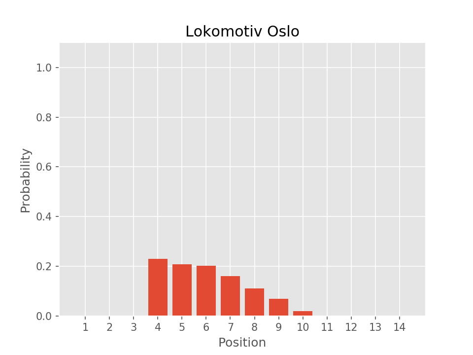

# Fotball season simulator

Simulate the remaining matches of the season. This program computes every possible configuration of
outcomes in the remaining matches by brute force.

Currently, this is limited to a tournament with 14 teams, and the input data is gathered from a
`.csv` file of the season fixtures. As an example, look at
[fotball.no](`https://www.fotball.no/fotballdata/turnering/terminliste/?fiksId=158515`).

You can specify which rounds you want to simulate, and all unplayed games in these rounds will be
run. Because of the combinatorical explosion, anything above three rounds is infeasibly expensive
to run. The number of simulated results is depending on the number of outcomes in each game (home
win, away win, and draw), and the number of games simulated:

```
num_outcomes_total = num_outcomes_per_game ^ num_games
```

Running on a computer with 12 Intel(R) Core(TM) i7-3930K CPU @ 3.20GHz processors, and 32 GB
memory, the following is approximate timings based on one run.

| Number of games | Total number of outcomes |  Time (s)   |
|:----------------|-------------------------:|------------:|
|               7 |                    2 187 |      0.0077 |
|              14 |                4 782 969 |     12.41   |
|              21 |           10 460 353 203 | 28 627.96   |

## Build

If you do not have rust installed, you can install it by following the instructions in
`https://www.rust-lang.org/en-US/install.html`.

Then, you clone this repo, and build it as

```
cargo build --release
```

You need the fixtures, which can be downloaded from
`https://www.fotball.no/fotballdata/turnering/terminliste/?fiksId=158515`, note that this is in
Excel format, and needs to be converted to `.csv`.

## Run

When this is done, you can run it as

```
./target/release/football_simulator --season_fixtures /path/to/fixtures.csv
```

Note that currently, which rounds are simulated is hard-coded. If you want to change it, you need
to change the `rounds` variable in `src/main.rs`. Once it is changed, you need to recompile the
program.

This program can be used to compute two different things. One computes and stores every possible
table outcome, and this is invoked by the `--task=tables` flag. The other one computes
distributions of the possible positions for each team, and this is invoked by the
`--task=standings` flag. Note that the table version is very memory expencive, and I have not
tested it above games. The other version does not require a lot of memory (as the tables are not
stored), but is a bit slower since it does every computation as the table option, in addition to
some other computations (the timings above are for the `--task=tables` version).

## Plot distributions

You can use the `plot_standing_distributions.py` to generate plots of the distributions

```
python plot_standing_distributions.py -i=/path/to/outcome_distribution.csv -o=/result/directory
```

## Example

Results after simulation of round 24, 25, and 26.

| Team           |           1 |           2 |           3 |          4 |          5 |          6 |          7 |          8 |          9 |         10 |         11 |         12 |         13 |          14 |
|:---------------|------------:|------------:|------------:|-----------:|-----------:|-----------:|-----------:|-----------:|-----------:|-----------:|-----------:|-----------:|-----------:|------------:|
| Ready          |           0 |           0 |           0 |   60859107 |  208635426 |  429284043 |  897513453 | 1463553522 | 2320194861 | 4274471088 |  791492796 |   14348907 |          0 |           0 |
| Follo          |           0 |           0 |           0 |  551124000 |  946636389 | 1312880157 | 1691379873 | 2140478136 | 2066920578 | 1631497626 |  119436444 |          0 |          0 |           0 |
| Rilindja       |           0 |           0 |           0 |          0 |          0 |       9639 |    6076863 |   57634902 |  226673640 |  784991655 | 5596146468 | 3214863756 |  573956280 |           0 |
| KFUM 2         |           0 |           0 |           0 |          0 |          0 |          0 |          0 |    5511240 |   56805138 |  209446803 | 3278794140 | 5659846650 | 1249949232 |           0 |
| Kristiansund 2 |           0 |           0 |           0 |          0 |          0 |          0 |          0 |          0 |          0 |          0 |  256686003 | 1567219509 | 8507307528 |   129140163 |
| Drøbak-Frogn   |           0 |           0 |           0 | 3627800946 | 2305730043 | 1800739350 | 1288291230 |  930826566 |  423356544 |   83608524 |          0 |          0 |          0 |           0 |
| Hødd 2         |           0 |           0 |           0 |          0 |          0 |          0 |          0 |          0 |          0 |          0 |          0 |          0 |  129140163 | 10331213040 |
| Oppsal         | 10446004296 |    14348907 |           0 |          0 |          0 |          0 |          0 |          0 |          0 |          0 |          0 |          0 |          0 |           0 |
| Træff          |           0 |   258280326 | 10202072877 |          0 |          0 |          0 |          0 |          0 |          0 |          0 |          0 |          0 |          0 |           0 |
| Spjelkavik     |           0 |           0 |           0 | 2637643500 | 2722007268 | 2043194544 | 1427788539 |  958640103 |  531571491 |  136737558 |    2770200 |          0 |          0 |           0 |
| Lokomotiv Oslo |           0 |           0 |           0 | 2407779594 | 2180030031 | 2120798781 | 1675158651 | 1154494701 |  723324735 |  195413310 |    3353400 |          0 |          0 |           0 |
| Molde 2        |    14348907 | 10187723970 |   258280326 |          0 |          0 |          0 |          0 |          0 |          0 |          0 |          0 |          0 |          0 |           0 |
| Ullern         |           0 |           0 |           0 |  396827991 |  871826409 | 1241946108 | 1556164062 | 1856737323 | 2245996674 | 1955955519 |  330824736 |    4074381 |          0 |           0 |
| Herd           |           0 |           0 |           0 |  778318065 | 1225487637 | 1511500581 | 1917980532 | 1892476710 | 1865509542 | 1188231120 |   80849016 |          0 |          0 |           0 |


